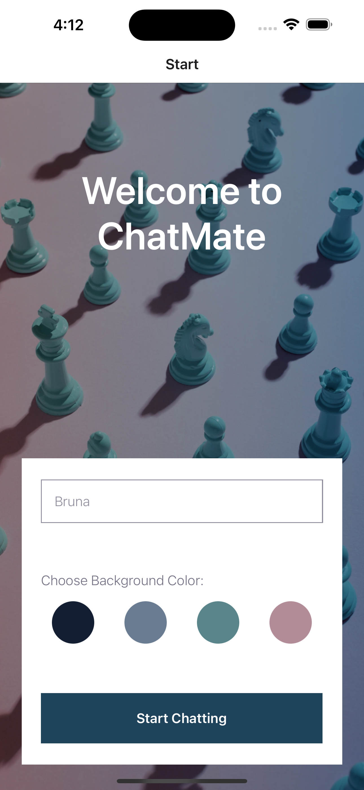
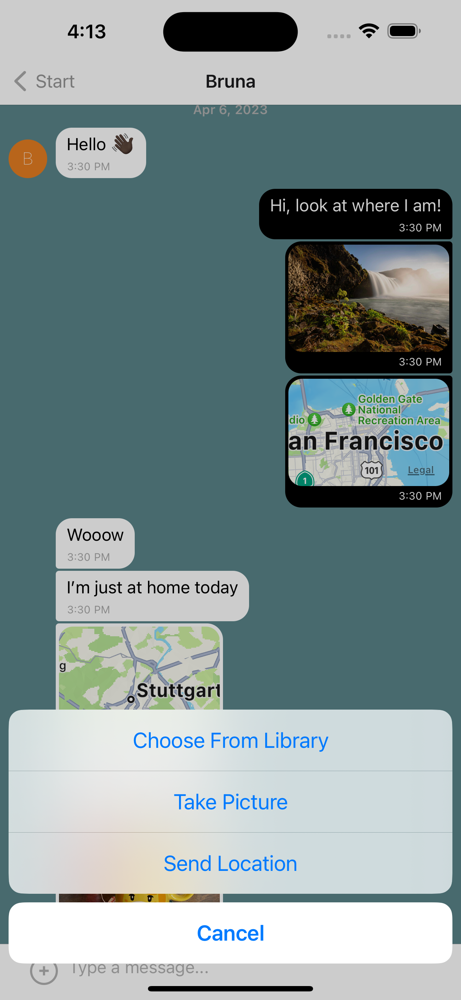
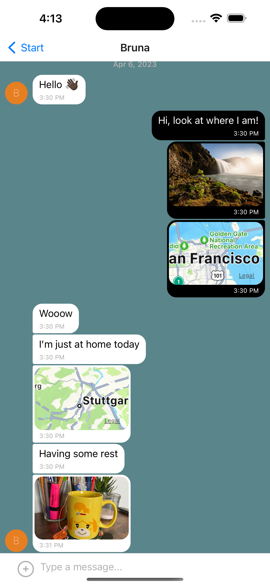

# ChatMate App





The objective of this project is to build a chat app for **mobile devices** using **React Native**. The app will provide users with a chat interface and options to share images and their location.

### Key Features:

- A page where users can enter their name and choose a background color for the chat screen before joining the chat
- A page displaying the conversation, as well as an input field and submit button.
- The chat provide users with two additional communication features: sending images and location data.
- Data gets stored online and offline.

### Build with:

- React Native
- React Gifted Chat
- Expo
- Firebase

## Setting up the ChatMate App

### Setting up the development environment

-   Install Expo CLI:  `npm install expo-cli -g`  and login with your Expo account using  `expo login`
-   Install necessary dependencies running `npm install` or `npm i` in you terminal
-   Install the Expo Go App from  [Apple Store](https://apps.apple.com/us/app/expo-go/id982107779)  or  [Google Play Store](https://play.google.com/store/apps/details?id=host.exp.exponent&gl=DE)  to test the project on your mobile device
-   Install  [Android Studio](https://developer.android.com/studio)  for Android Emulator or  [Xcode](https://apps.apple.com/de/app/xcode/id497799835?mt=12)  for ios Simulator to test the app

### Setting up your database

-   Sign in at Google Firebase
-   Create a new project
-   Create a Firestore Database for you project
-   At 'Settings' -> 'General' -> 'Your apps' -> 'Firestore for Web' generate your configuration object.
-   In the  `App.js`  file replace the  `firebaseConfig`  variable with the configuration info from your own Firestore database:

```
firebase.initializeApp({
  apiKey: "your-api-key",
  authDomain: "your-authdomain",
  projectId: "your-project-id",
  storageBucket: "your-storage-bucket",
  messagingSenderId: "your-messaging-sender-id",
  appId: "your-app-id",
});
```
### Run ChatMate App

-   Start the app by running  `npx expo start`  or  `expo start`
-   Using the Expo Go app on you mobile device, start ChatMate by scanning the QR code in your terminal
-   Using the Emulator/Simulator press  `a`  for Android or  `i`  for iOS

### Technical Dependencies:

```
"dependencies": {
"@react-navigation/native": "^6.1.6",
"@react-navigation/native-stack": "^6.9.12",
"expo": "~48.0.9",
"expo-status-bar": "~1.4.4",
"firebase": "^9.13.0",
"react": "18.2.0",
"react-native": "0.71.4",
"react-native-gifted-chat": "^2.0.1",
"react-native-safe-area-context": "4.5.0",
"react-native-screens": "~3.20.0",
"@react-native-async-storage/async-storage": "1.17.11",
"@react-native-community/netinfo": "9.3.7",
"expo-image-picker": "~14.1.1",
"expo-location": "~15.1.1",
"react-native-maps": "1.3.2"
}
```